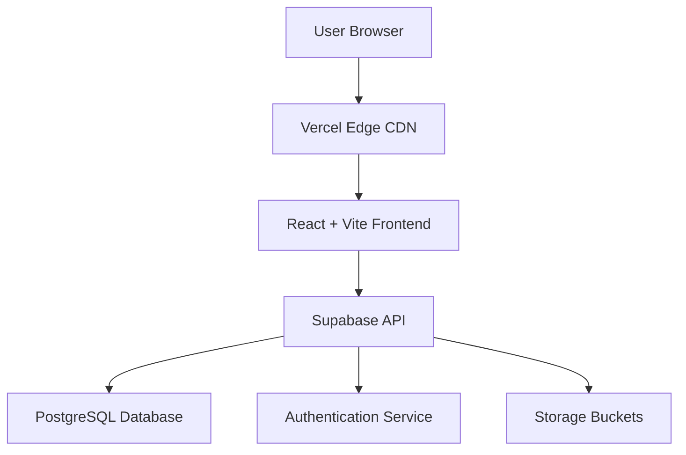

# ☁️ Mithil Katkoria - Portfolio Website


> **Note:** This project was originally created & tested on localmachine and migrated to a self-hosted Supabase + Vercel setup for full control and scalability.

## 🌐 Live Website
**[mithilkatkoria.vercel.app](https://mithilkatkoria.vercel.app)**

---

## 📋 Project Overview

This is my personal portfolio website showcasing projects, achievements, research, and professional experience. The site features:

- **Modern UI** with animated backgrounds and glassmorphism effects
- **Responsive design** for all devices
- **Dynamic content management** through Supabase database
- **Live chat integration** for visitor engagement
- **Admin dashboard** for content updates (private access only)
- **Fast performance** with Vite build optimization

## 🛠️ Technology Stack

| Layer | Technology | Purpose |
|-------|------------|---------|
| **Frontend** | React 18 + TypeScript | UI Development |
| **Build Tool** | Vite | Fast builds & dev server |
| **Styling** | Tailwind CSS + Shadcn/ui | Utility-first CSS & components |
| **Backend** | Supabase | Database & Authentication |
| **Database** | PostgreSQL | Data storage with RLS |
| **Deployment** | Vercel | Hosting & CI/CD |
| **Analytics** | Tawk.to | Live chat & visitor tracking |

## 📁 Project Structure

```text
theclouds-main/
├── src/
│   ├── components/
│   │   ├── ui/                # shadcn/ui components
│   │   ├── admin/             # Admin dashboard components
│   │   ├── Navigation.tsx
│   │   ├── Hero.tsx
│   │   ├── StarfieldBackground.tsx
│   │   └── ...
│   ├── pages/
│   │   ├── admin/             # /admin routes
│   │   ├── projects/
│   │   ├── research/
│   │   ├── applab/
│   │   └── ...
│   ├── integrations/
│   │   └── supabase/
│   │       ├── client.ts
│   │       └── types.ts
│   ├── hooks/
│   ├── lib/
│   ├── App.tsx
│   ├── main.tsx
│   └── index.css
├── supabase/
│   ├── migrations/            # Database schema & RLS policies
│   └── config.toml
├── public/
├── .env
├── package.json
├── vite.config.ts
└── README.md
```

## 🚀 Getting Started

### Prerequisites
- Node.js 18+ and npm/yarn/bun
- Git for version control
- Supabase account (free tier available)

### Installation

```bash
# 1. Clone the repository
git clone https://github.com/astro-mx-m1/portfolio.git
cd portfolio

# 2. Install dependencies
npm install

# 3. Set up environment variables
cp .env.example .env.local
# Edit .env.local with your credentials

# 4. Start development server
npm run dev
```

## 📁 Enviromental Variables

VITE_SUPABASE_URL = hltps://contact-me-for-more-info-as-this-is-private-info:).co

VITE_SUPABASE_PUBLISHABLE_KEY = contact-me-for-more-info-as-this-is-private-info:)

VITE_SUPABASE_PROJECT_ID = contact-me-for-more-info-as-this-is-private-info:)


## ▶️ Available Scripts

```bash
npm run dev          # Start development server
npm run build        # Build for production
npm run preview      # Preview production build
npm run lint         # Run ESLint
```

---

## 🧠 Admin Dashboard

The website includes a private **admin dashboard** used to manage all dynamic content without modifying the codebase.

- **Route:** `/admin`
- **Authentication:** Supabase Auth (JWT-based)
- **Authorisation:** Role-based access (Admin only)

### Editable Content
- Projects
- Research articles & essays
- Achievements & certificates
- Academic records
- Leadership experience
- Navigation items
- Site-wide settings

All changes are reflected **instantly** on the public website.

---

## 🏗️ System Architecture


# 📊 Database Schema Overview

| Table                 | Description                       |
|-----------------------|-----------------------------------|
| profiles              | User profile information           |
| user_roles            | Role-based access control          |
| projects              | Portfolio project entries          |
| achievements          | Awards and certificates            |
| research_articles     | Research pieces and essays         |
| navigation_items      | Site navigation structure          |
| site_settings         | Global configuration values        |
| redirects             | URL redirect rules                 |
| academics             | Academic records                   |
| app_lab_content       | App Lab content                    |
| leadership            | Leadership experience              |
| pages                 | Custom static pages                |

# 🚢 Deployment

## Automatic Deployment
- **Platform:** Vercel  
- **Trigger:** Push to the main branch  
- **CI/CD:** Enabled by default  

## Manual Deployment
```bash
npm run build
npm run preview
```

## Environment Configuration
- Environment variables are securely stored in the Vercel dashboard  
- No secrets are committed to version control  

## 🗺️ Roadmap
- Blog / long-form writing system  
- Dark / light theme toggle  
- Project filtering and tagging  
- Newsletter integration  
- Performance and usage analytics  
- Multi-language support  

## ❓ FAQ

**How do I update site content?**  
Use the admin dashboard at `/admin` or edit records directly via the Supabase Table Editor.  

**Can this project be reused as a template?**  
Yes. You may fork the repository and replace the content with your own.  

**How do I customise the design?**  
Edit `tailwind.config.ts` and update design tokens in `src/index.css`.  

## 🙏 Acknowledgments
- **Supabase** — backend infrastructure and authentication  
- **Vercel** — hosting and deployment  
- **shadcn/ui** — UI components  
- **Lovable** — initial project scaffolding  

## 📄 License
This project is licensed under the MIT License.  
See the `LICENSE` file for details.
